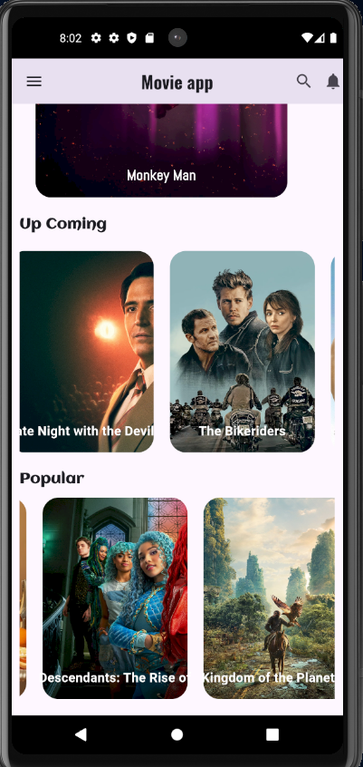
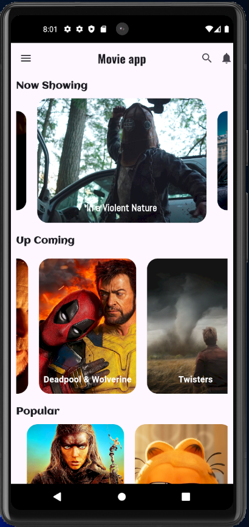

# Fourth Project - Movie App with tmdb APIs

The Movie App is a Flutter-based mobile application that allows users to browse, search, and get detailed information about movies. Users can view movies under three main categories: Now Showing, Upcoming, and Popular. The app features a user-friendly interface and utilizes three different TMDB (The Movie Database) APIs to fetch movie data.

## Features

- **Now Showing Movies**: Browse movies that are currently showing in theaters.
- **Upcoming Movies**: Discover movies that are scheduled to be released soon.
- **Popular Movies**: Check out the most popular movies among viewers.


## Screenshots




## Getting Started

These instructions will get you a copy of the project up and running on your local machine for development and testing purposes.

### Prerequisites

- Flutter SDK: [Install Flutter](https://flutter.dev/docs/get-started/install)
- Visual Studio Code (recommended): [Install VS Code](https://code.visualstudio.com/)

### Installation

1. **Clone the repository**:
   ```bash
   git clone https://github.com/Zero2Lab/Movie-App-with-API.git
   cd Movie-App-with-API
